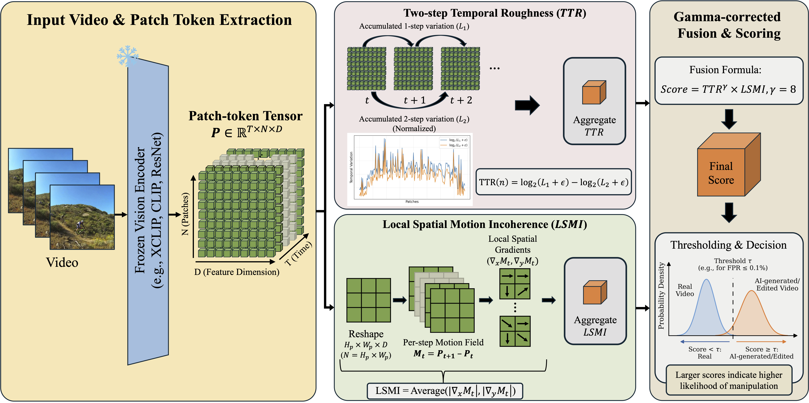

# SPLIT: Training-Free AI-Generated and Partially Edited Video Detection via Spatial Patch-Level Incoherence and Temporal Roughness

[](https://arxiv.org/abs/2607.02886)

This repository provides the official implementation of **SPLIT: Training-Free AI-Generated and Partially Edited Video Detection via Spatial Patch-Level Incoherence and Temporal Roughness**, accepted at **ECCV 2026**.

**Authors:** Jongyeop Hyun and Hyounghun Kim


Fig. 2: Overview of SPLIT. A frozen vision encoder produces patch tokens $P \in \mathbb{R}^{T \times N \times D}$, from which two signals are computed: *Two-step Temporal Roughness (TTR)*, comparing 1-step and 2-step feature variations, and *Local Spatial Motion Incoherence (LSMI)*, measuring spatial gradients of a feature-space motion field. These are combined via gamma-corrected multiplicative fusion and thresholded using real-only calibration to classify videos as real or AI-generated/edited.


## Contents

- [Environment](#environment)
- [Data Preparation](#data-preparation)
- [Evaluation](#evaluation)
- [Related Benchmarks](#related-benchmarks)
- [Acknowledgement](#acknowledgement)
- [Citation](#citation)

## Environment

The code was prepared for Python 3.11.

```bash
git clone https://github.com/mldljyh/SPLIT.git
cd SPLIT
pip install -r requirements.txt
```

The default evaluation path uses CUDA. Please install a PyTorch build that matches your GPU driver and CUDA runtime if the pinned package in `requirements.txt` is not suitable for your machine.

## Data Preparation

SPLIT expects each benchmark to be organized with videos, extracted frames, and CSV files:

```text
<dataset>/
|-- video/
|   |-- <subset_name>/
|   |   |-- <video_id>.mp4
|   |   `-- ...
|   `-- ...
|-- frames/
|   |-- <subset_name>/
|   |   |-- <video_id>/
|   |   |   |-- 1.jpg
|   |   |   |-- 2.jpg
|   |   |   `-- ...
|   |   `-- ...
|   `-- ...
`-- csv/
    |-- <real_subset>.csv
    |-- <fake_subset>.csv
    `-- ...
```

Create the basic folders for a dataset:

```bash
mkdir -p <dataset>/video <dataset>/frames <dataset>/csv
```

Place videos under `video/<subset_name>/`, then extract frames:

```bash
python utils/video2frame.py --dataset-path <dataset>
```

Generate CSV metadata for each subset. Real videos should use label `0`; generated or edited videos should use label `1`.

```bash
python utils/folder2csv.py --is-real True --dataset-path <dataset> --folders <real_subset>
python utils/folder2csv.py --is-real False --dataset-path <dataset> --folders <fake_subset>
```

Each CSV must contain a `content_path` column pointing to a directory of extracted frames.

### GenVideo Example

The following example shows one way to prepare GenVideo validation data in the expected format.

```bash
mkdir -p GenVideo/video GenVideo/frames GenVideo/csv

wget https://modelscope.cn/datasets/cccnju/Gen-Video/resolve/master/GenVideo-Val.zip
unzip GenVideo-Val.zip

mv GenVideo-Val/Real GenVideo/video/real_MSRVTT
mv GenVideo-Val/Fake/* GenVideo/video/
```

Extract frames and build CSV files:

```bash
python utils/video2frame.py --dataset-path GenVideo

python utils/folder2csv.py --is-real True --dataset-path GenVideo --folders real_MSRVTT
python utils/folder2csv.py --is-real False --dataset-path GenVideo --folders Crafter Gen2 HotShot Lavie ModelScope MoonValley MorphStudio Show_1 Sora WildScrape
```

## Evaluation

Run `eval.py` with one or more real CSVs and one or more fake CSVs:

```bash
python eval.py \
  --gpu-id 0 \
  --encoder XCLIP-16 \
  --real-csv <dataset>/csv/<real_subset>.csv \
  --fake-csv <dataset>/csv/<fake_subset>.csv
```

Available encoders are:

```text
CLIP-16, CLIP-32, XCLIP-16, XCLIP-32, DINO-base, DINO-large,
ResNet-18, VGG-16, EfficientNet-b4, MobileNet-v3
```

The script reports AP for real and fake classes, mAP, ROC AUC, best-F1 precision/recall, and fake recall at selected false-positive rates. A text copy of each run is saved in `results/`.

## Related Benchmarks

- [FakeParts](https://github.com/hi-paris/FakeParts)
- [GenVideo](https://github.com/chenhaoxing/DeMamba)
- [ViF-Bench](https://huggingface.co/datasets/JoeLeelyf/ViF-Bench)

## Acknowledgement

We thank the authors of [D3](https://github.com/Zig-HS/D3) and [DeMamba](https://github.com/chenhaoxing/DeMamba) for releasing useful code and resources that supported this project.

## Citation

If you find this repository useful, we would appreciate it if you cited it in your research:

```bibtex
@misc{hyun2026splittrainingfreeaigeneratedpartially,
      title={SPLIT: Training-Free AI-Generated and Partially Edited Video Detection via Spatial Patch-Level Incoherence and Temporal Roughness}, 
      author={Jongyeop Hyun and Hyounghun Kim},
      year={2026},
      eprint={2607.02886},
      archivePrefix={arXiv},
      primaryClass={cs.CV},
      url={https://arxiv.org/abs/2607.02886}, 
}
```
